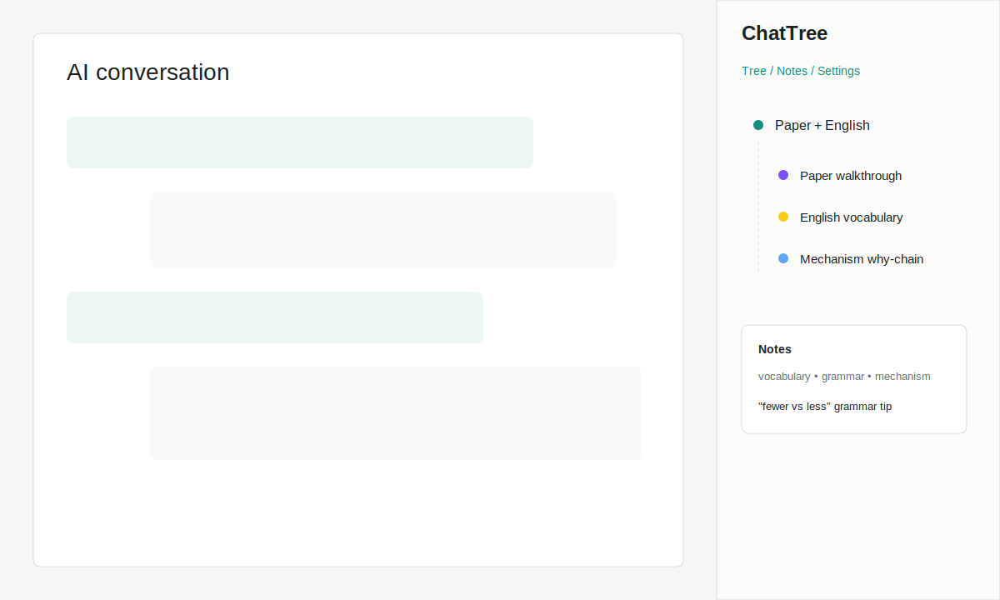

[English](README.md)

# ChatTree

ChatTree 是一个 Manifest V3 Chrome 扩展，会在 ChatGPT、Claude.ai 和 Gemini 页面右侧叠加一个 320px 的树状侧边栏。它把线性的 AI 对话整理成分支、摘要、高亮和复习笔记。

## 使用场景

一位博士生正在和 AI 助手一起阅读一篇基础生态毒理学论文。对话逐渐混合成三类活动：论文逐段讲解、英语词汇学习、生物机制的连续“为什么”追问。ChatTree 会把它们显示为根节点下的三个分支，这样像 “fewer vs less” 这样的语法笔记，就能和 “estrogen -> vitellogenin -> egg production” 这样的机制笔记分开复习。



## 支持的网站

- ChatGPT：`https://chatgpt.com/*` 和 `https://chat.openai.com/*`
- Claude.ai：`https://claude.ai/*`
- Gemini：`https://gemini.google.com/*`

## 安装

1. 运行 `pnpm install` 安装依赖。
2. 运行 `pnpm build` 构建扩展。
3. 打开 Chrome，进入 `chrome://extensions`。
4. 开启开发者模式。
5. 点击“加载已解压的扩展程序”，选择生成的 `dist/` 目录。

## Chrome Web Store 打包

用下面的命令生成可上传到 Chrome Web Store 的 zip：

```bash
pnpm package:chrome
```

打包脚本会先运行 production build，再校验生成后的 MV3 manifest，最后把上传文件写到 `release/chattree-chrome-v0.1.0.zip`。

商店提交材料在 `store/` 目录：

- `store/chrome-web-store-listing.md`：中英双语商店文案、截图计划和审核测试说明。
- `store/privacy-policy.md`：中英双语隐私政策草稿，提交前需要发布到稳定公开 URL。
- `store/permission-justification.md`：Developer Dashboard 里可使用的权限和 host access 说明。
- `store/release-checklist.md`：本地检查和提交清单。

## 配置

1. 打开 ChatTree options 页面。
2. 选择 OpenAI 或 Anthropic。
3. 输入模型名称和你自己的 API key。
4. 保存设置。

API key 会用 AES-GCM 加密后存入 `chrome.storage.local`。ChatTree 不使用 `chrome.storage.sync`，也不包含遥测。对话树、笔记、高亮、标签和导入数据会通过 Dexie 按对话存入 IndexedDB。

## MVP 功能

- 右侧分支树侧边栏，支持点击跳转消息和 pin 节点。
- 使用 MutationObserver 解析 DOM，并为三个目标网站提供多组 fallback selector。
- 为 ChatGPT 和 Gemini 风格 DOM 增加了 adapter 测试。
- IndexedDB 恢复流程会为当前对话重新加载树、笔记、高亮、标签和摘要。
- 支持历史对话分支拆分建议，并提供接受/拒绝操作。
- Analyze 操作会读取完整 transcript，把树重写成活动分支，而不是机械地一条消息生成一个节点。
- 使用用户自己的 API key 调用 LLM，生成短标题和 3-5 句摘要。
- 摘要结果会写回根节点或选中的节点。
- 支持文本高亮和笔记，使用选中文本、偏移量和邻近上下文做稳健锚定。
- Notes 标签页按消息分组，并支持 `vocabulary`、`grammar`、`mechanism` 等标签过滤。
- JSON 和 Markdown 导出辅助函数，内联树、摘要、笔记、高亮和标签。
- ChatGPT `conversations.json` 和 Claude JSON 导入解析骨架，并提供主题转移分支建议。
- 增加扩展 popup、options 页删除 key 功能和基础扩展图标。

## 开发

```bash
pnpm install
pnpm test
pnpm build
```

如果要用已安装的 Chromium 浏览器做扩展 smoke test：

```powershell
$env:CHROME_PATH='C:\Program Files (x86)\Microsoft\Edge\Application\msedge.exe'
$env:SMOKE_HEADLESS='0'
$env:SMOKE_URL='https://chatgpt.com/'
pnpm smoke:extension
```

smoke test 会注入混合的论文 / 英语 / 机制消息，点击 Analyze，并验证侧边栏生成了对应活动分支。把 `SMOKE_URL` 改成 `https://claude.ai/` 或 `https://gemini.google.com/` 可以测试对应 adapter。

## 项目结构

```text
ChatTree/
  .github/workflows/build.yml
  docs/screenshot-placeholder.svg
  manifest.json
  options.html
  package.json
  postcss.config.cjs
  tailwind.config.ts
  tsconfig.json
  vite.config.ts
  scripts/
    generate-icons.mjs
    package-extension.mjs
    smoke-extension.mjs
  store/
    chrome-web-store-listing.md
    permission-justification.md
    privacy-policy.md
    release-checklist.md
  src/
    background/index.ts
    content/domParser.ts
    content/highlightRenderer.ts
    content/index.tsx
    content/selectionAnchors.ts
    options/main.tsx
    shared/crypto.ts
    shared/export.ts
    shared/import.ts
    shared/messages.ts
    shared/schema.ts
    shared/storage.ts
    sidebar/mockData.ts
    sidebar/SidebarApp.tsx
    sidebar/store.ts
    styles/tailwind.css
    types/rangy.d.ts
```

## 路线图

- 改进 LLM 辅助的历史对话分支拆分确认流程。
- 增加基于 embeddings 的语义搜索。
- 增加多模型切换。
- 移植到 Firefox。
- 为 Chrome Web Store 审核补充正式截图，并发布隐私政策 URL。
- 增加可选的跨设备同步。

## 许可证

MIT。见 [LICENSE](LICENSE)。
